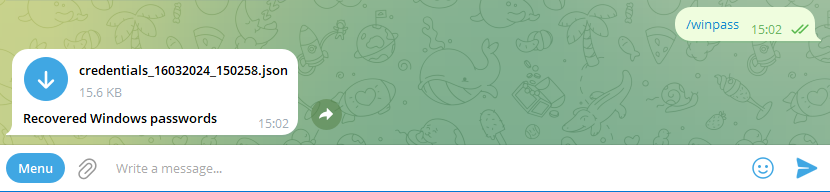
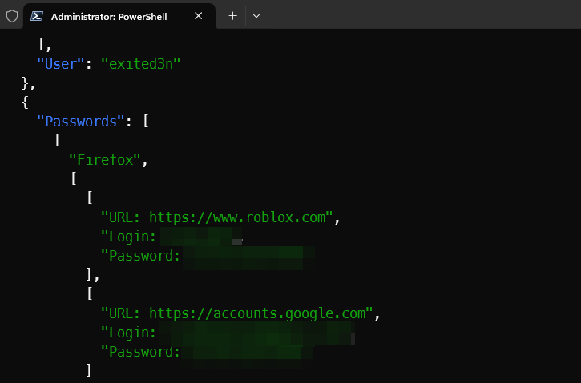

## 🔮 pyradm
> Remote administration crossplatfrom tool via telegram\
> Coded with ❤️ **python3** + **aiogram3**\
> https://t.me/pt_soft \
> https://t.me/pt_feedback_bot

### 💻 v0.4 - Added Windows credentials recovery
- [X] Screenshot from target
- [X] Crossplatform
- [X] Upload/Download
- [X] Fully compatible shell
- [X] Process list
- [X] Webcam (video record or screenshot)
- [X] Geolocation
- [X] Filemanager
- [X] Microphone
- [X] Clipboard (text, image)
- [X] Windows credentials recovery (browsers, dbs, chats, mail, etc) 

🔗 Many thanks to the [LaZagne](https://github.com/AlessandroZ/LaZagne/tree/master) project \
🔗 All supported [software](https://github.com/AlessandroZ/LaZagne/tree/master#supported-software)

## ⚙️ Functional

```
/start - start pyradm
/help - help
/shell - shell commands
/sc - screenshot
/download - download (abs. path)
/info - system info
/ip - public ip address and geolocation
/ps - process list
/webcam 5 - record video (secs)
/webcam - screenshot from camera
/fm - filemanager
/fm /home or /fm C:\
/mic 10 - record audio from mic
/clip - get clipboard data
/winpass - credentials recovery

Press button to download file
Send any file as file for upload to target
```

## 📘 Install
* `git clone https://github.com/akhomlyuk/pyradm.git`
* `cd pyradm`
* `pip3 install -r requirements.txt`
* `Put bot token to cfg.py, ask @Bothfather`
* `python3 main.py`

## 🚥 Compile
* `Put bot token to cfg.py`
* `pip install nuitka`
* `nuitka --mingw64 --onefile --follow-imports --remove-output -o pyradm.exe main.py`

## 📷 Screens




[](http://hits.dwyl.com/akhomlyuk/pyradm)